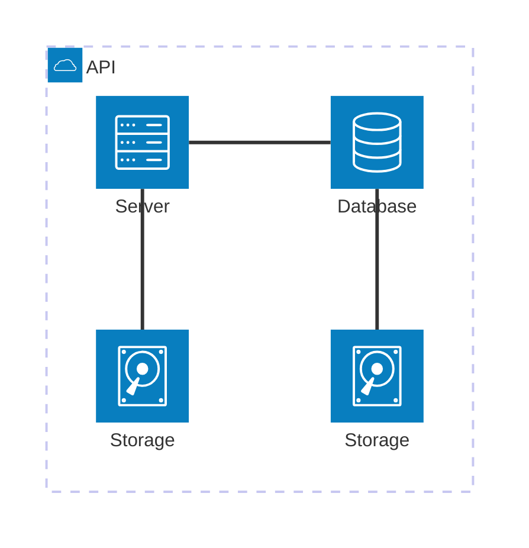

# Architecture Diagram

Syntax authority: the official default example below (`@mermaid-js/examples` 1.4.0, MIT; keyword `architecture-beta`).

## Default example: Basic System Architecture

## Fit

System components, services, groups, boundaries, entry points, stores, connections.

## Rules

- Draw ownership boundaries and components first; add real dependency edges.
- Edge labels use relation verbs: `reads`, `writes`, `routes`, `validates`.
- Icons aid recognition only and never replace node names.

## Avoid

Do not draw time-ordered flow as architecture; do not let position imply deployment boundaries; if `architecture-beta` fails to parse, rebuild from the current Live Editor example.
