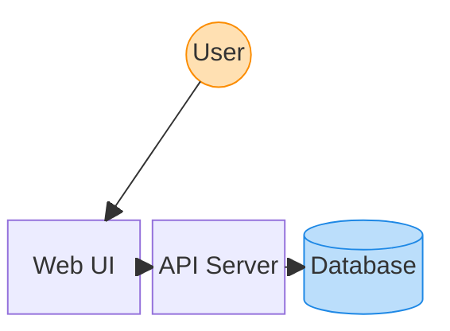

# Block Diagram

Syntax authority: the official default example below (`@mermaid-js/examples` 1.4.0, MIT; keyword `block-beta`).

## Default example: Three-Tier Web Architecture

## Fit

Two-dimensional blocks, grids, nested regions, occupancy, hardware/module layout.

## Rules

- Block diagrams are about spatial layout, not auto-flowed process.
- Control structure with `columns`, block widths, and `space`.
- Edges supplement relations; they do not replace layout meaning.

## Avoid

Do not let block widths, columns, and content length contradict each other; check the current editor example when syntax details shift.
