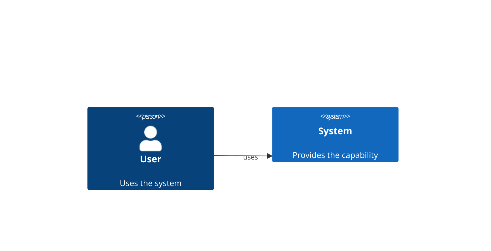

# C4

## Purpose
C4 model views: system context, containers, components, dynamic views, deployment.

## Minimal syntax

## Rules
- Fix one diagram to one C4 level; choose `C4Context`/`C4Container`/`C4Component`/`C4Dynamic`/`C4Deployment` accordingly.
- `Person`, `System`, `Container`, `Component`, `Rel` semantics must match the level.
- Dynamic views complement timing; they do not replace the static container view.

## Avoid
Do not treat C4 as any boxed architecture; do not draw cross-level relations without explanation.
