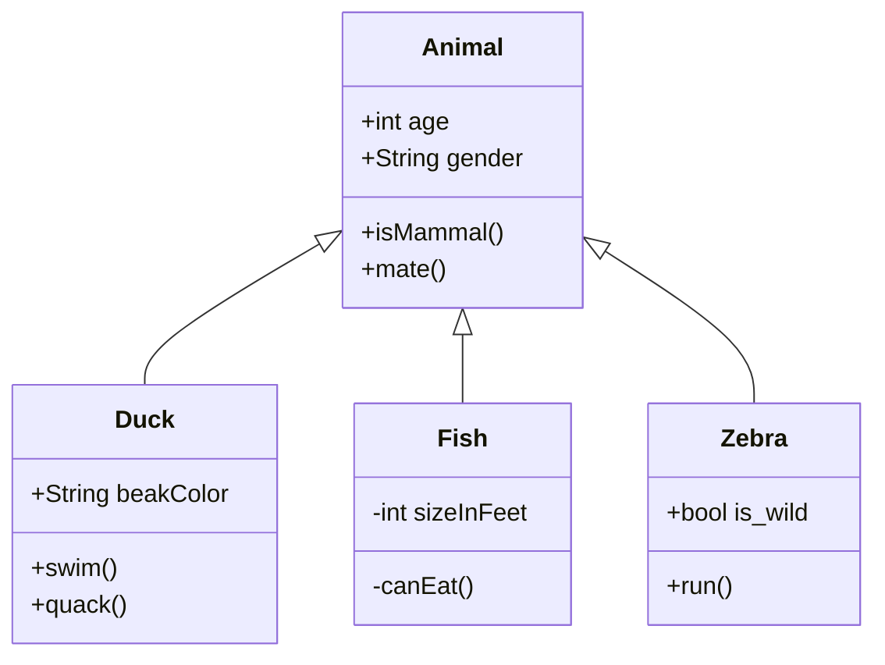

# Class Diagram

Syntax authority: the official default example below (`@mermaid-js/examples` 1.4.0, MIT; keyword `classDiagram`).

## Default example: Basic Class Inheritance

## Fit

Classes, interfaces, attributes, methods, inheritance, realization, aggregation, composition, dependency.

## Rules

- Class diagrams carry static structure, not call order or state transitions.
- Keep visibility markers, types, and relation endpoints consistent.
- Show only members relevant to the question; do not dump full source.

## Avoid

Do not use plain arrows for inheritance; do not confuse instance data, database columns, and class members.
