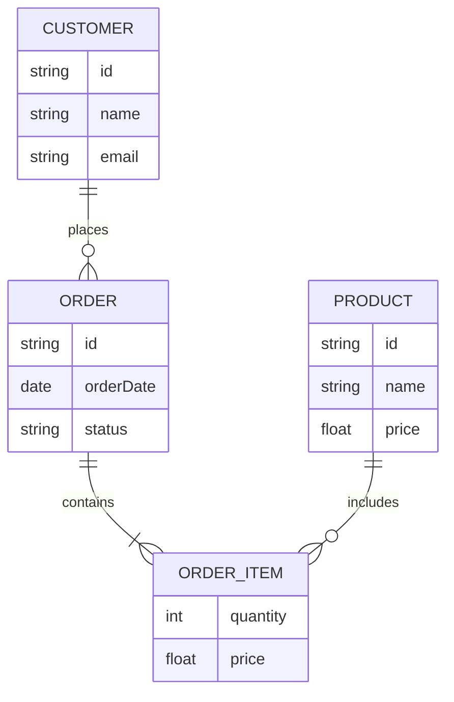

# Entity Relationship Diagram

Syntax authority: the official default example below (`@mermaid-js/examples` 1.4.0, MIT; keyword `erDiagram`).

## Default example: Basic ER Schema

## Fit

Entities, fields, primary/foreign keys, optionality, cardinality.

## Rules

- Define entity boundaries first, then fields and cardinality.
- PK/FK markers must match real constraints.
- Relation labels are domain verbs: `places`, `contains`.

## Avoid

Do not stuff class methods into entities; do not let layout imply cardinality; never invent fields without evidence.
