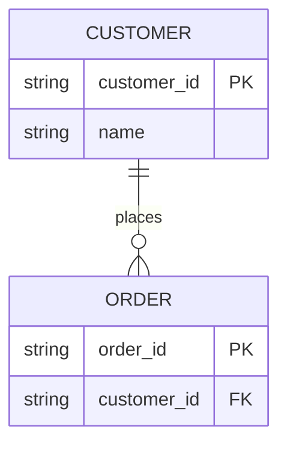

# Entity Relationship

## Purpose
Entities, fields, primary/foreign keys, optionality, cardinality.

## Minimal syntax

## Rules
- Define entity boundaries first, then fields and cardinality.
- PK/FK markers must match real constraints.
- Relation labels are domain verbs: `places`, `contains`.

## Avoid
Do not stuff class methods into entities; do not let layout imply cardinality; never invent fields without evidence.
