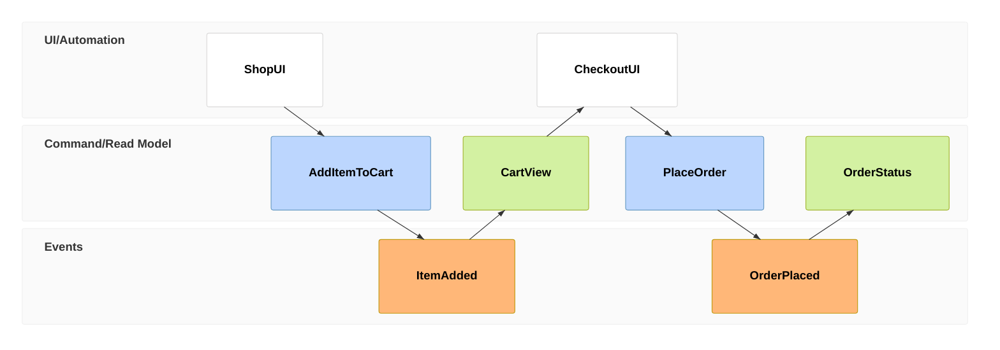

# Event Modeling Diagram

Syntax authority: the official default example below (`@mermaid-js/examples` 1.4.0, MIT; keyword `eventmodeling`).

## Default example: Shopping Cart Story

## Fit

Business timeline: commands, events, views, actors, systems, read models.

## Rules

- Events state facts that happened; commands state intent; views state readable results.
- Keep the timeline in a single direction.
- Every command points to the events it produces; every view names the events it consumes.

## Avoid

Never let model output become an event fact on its own; do not label commands, events, and views with one shared style.
