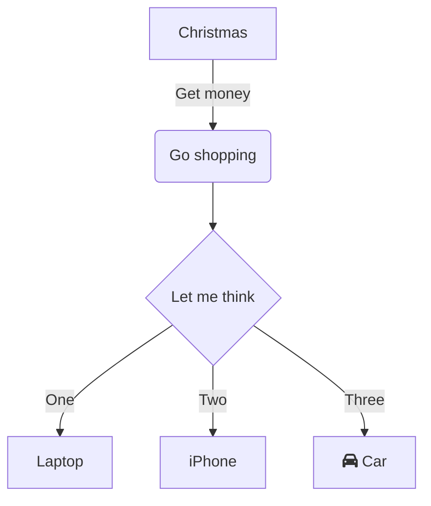

# Flowchart

Syntax authority: the official default example below (`@mermaid-js/examples` 1.4.0, MIT; keyword `flowchart TD`).

## Default example: Basic Flowchart

## Fit

Steps, conditions, branches, loops, inputs/outputs, error paths.

## Rules

- Pick `TD`/`LR` by primary reading direction; edge labels state conditions.
- Use stable English node IDs; display text can be Chinese.
- Every decision needs complete positive, negative, and terminal paths.

## Avoid

Do not turn a flowchart into a sequence, state, or architecture diagram; do not give every node the same shape and lose the decision semantics.

## Verified syntax pitfalls (measured on mermaid-cli 11.x)

- Labeled links must use the pipe form: `A -->|text| B` or `A -->|"text"| B`. The quoted-mid-link forms `A -- "text" --> B` and `A -. "text" --> B` throw `got 'STR'` parse errors; dotted labeled edges are `A -.->|text| B`.
- No chained double-arrow like `A <--> "t" --> B`; pick one directed labeled edge per relation.
- Node display text with ` `, `::` and CJK inside quoted brackets is fine; edge label text containing `/` is fine in pipe form.
