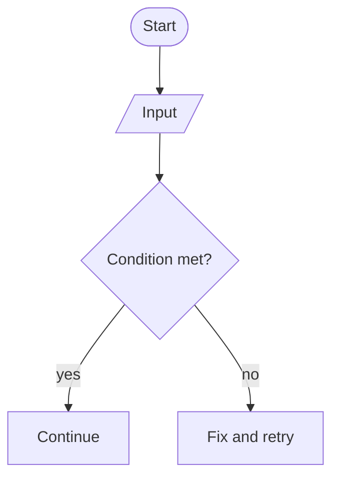

# Flowchart

## Purpose
Steps, conditions, branches, loops, inputs/outputs, error paths.

## Minimal syntax

## Rules
- Pick `TD`/`LR` by primary reading direction; edge labels state conditions.
- Use stable English node IDs; display text can be Chinese.
- Every decision needs complete positive, negative, and terminal paths.

## Avoid
Do not turn a flowchart into a sequence, state, or architecture diagram; do not give every node the same shape and lose the decision semantics.
