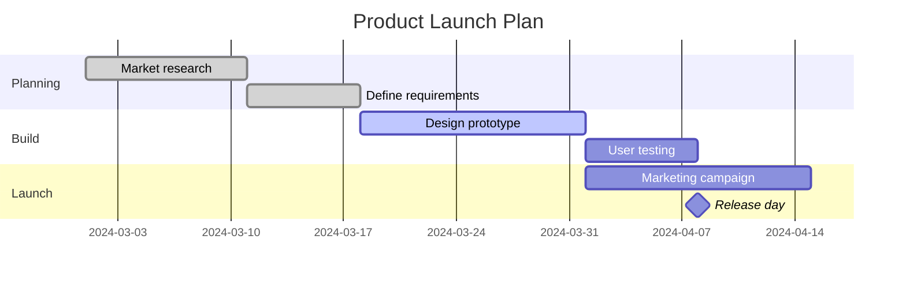

# Gantt Chart

Syntax authority: the official default example below (`@mermaid-js/examples` 1.4.0, MIT; keyword `gantt`).

## Default example: Product Launch Plan

## Fit

Tasks, phases, start/end dates, durations, completion state, dependencies.

## Rules

- Declare date format, timezone assumptions, and workday rules.
- Group with `section`; express dependencies with `after`.
- `done`/`active` must reflect real progress.

## Avoid

Do not use Gantt for dense causal networks; do not fake precise schedules for tasks with no date basis.
