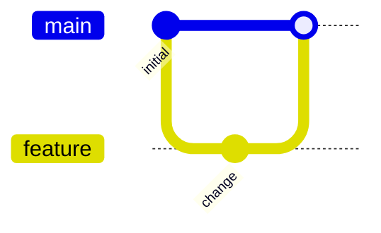

# Git

## Purpose
Commits, branches, checkouts, merges, tags, release lines.

## Minimal syntax

## Rules
- Each commit node represents a real history node or an explicitly pedagogical one.
- Branch names, order, and merges must match the target history.
- Use tags or commit ids for releases, rollbacks, baselines.

## Avoid
Do not use gitGraph as generic flow; never invent commits, branches, or merges.
