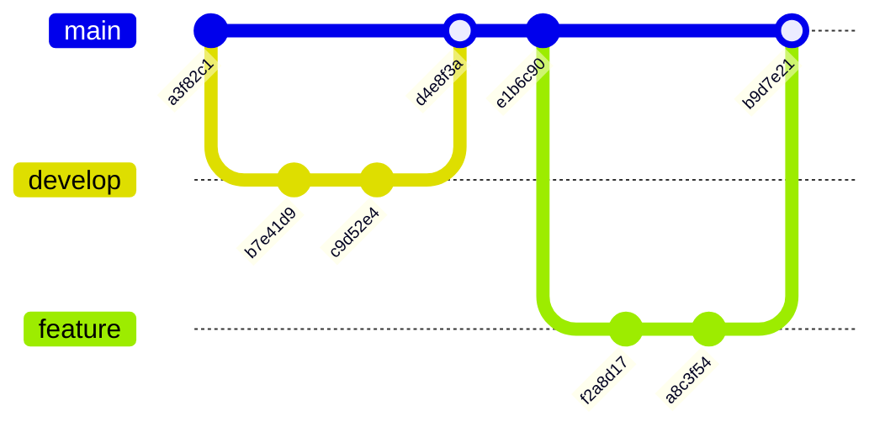

# Git Graph

Syntax authority: the official default example below (`@mermaid-js/examples` 1.4.0, MIT; keyword `gitGraph`).

## Default example: Basic Git Flow

## Fit

Commits, branches, checkouts, merges, tags, release lines.

## Rules

- Each commit node represents a real history node or an explicitly pedagogical one.
- Branch names, order, and merges must match the target history.
- Use tags or commit ids for releases, rollbacks, baselines.

## Avoid

Do not use gitGraph as generic flow; never invent commits, branches, or merges.
