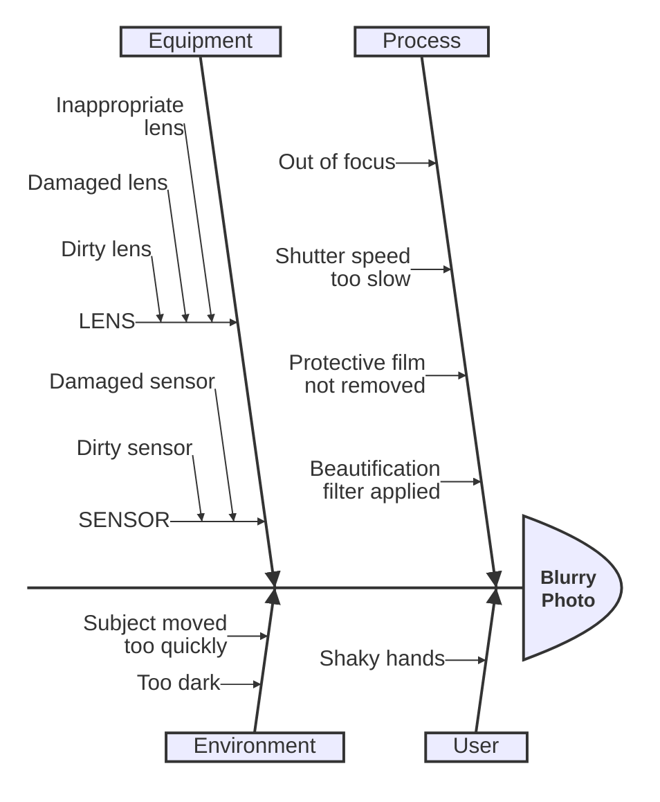

# Ishikawa Diagram

Syntax authority: the official default example below (`@mermaid-js/examples` 1.4.0, MIT; keyword `ishikawa-beta`).

## Default example: Ishikawa Diagram

## Fit

Trace one outcome back through cause categories (people, method, machine, material, measurement, environment) toward root causes.

## Rules

- The fish head is a verifiable outcome, not a vague goal.
- Bones are candidate causes; mark unverified ones as pending evidence.
- Analysis should end in actionable verification or improvement steps.

## Avoid

Do not draw parallel task lists as a fishbone; correlation is not causation.
