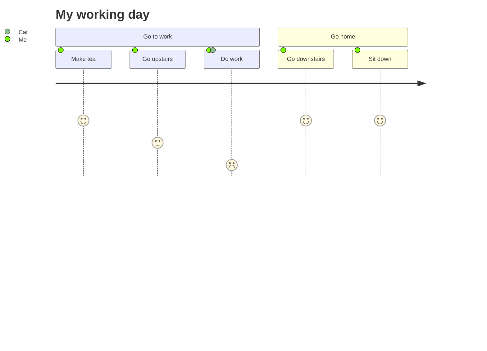

# User Journey Diagram

Syntax authority: the official default example below (`@mermaid-js/examples` 1.4.0, MIT; keyword `journey`).

## Default example: My Working Day

## Fit

User experience of a process: sections (phases), steps, a satisfaction score per step, and the actors involved.

## Rules

- Steps are ordered experience, not tasks with owners and dates (that is Gantt).
- Satisfaction scores are 1-5 and must reflect a real signal, not vibes.
- Keep steps short; one actor list per step.

## Avoid

Do not use a journey for project schedules; do not invent satisfaction numbers without a source.
