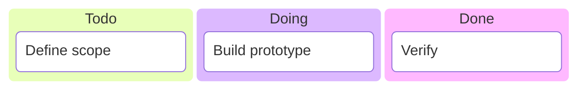

# Kanban

## Purpose
Work columns (backlog, doing, blocked, review, done) and cards inside them.

## Minimal syntax

## Rules
- Columns are work states or policy lanes; cards are traceable items.
- Card titles are short and actionable; mark blockers explicitly.
- Add WIP limits, owners, priorities only with real data.

## Avoid
Do not treat columns as a timeline; do not bury the board under card wall-text.
