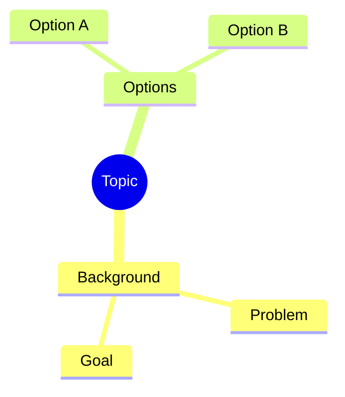

# Mindmap

## Purpose
Central topic expanding into concepts, options, notes, outlines — loose hierarchy.

## Minimal syntax

## Rules
- Indentation encodes parent/child; one central topic only.
- Same level holds parallel concepts, not causality.
- Split oversized branches into separate maps.

## Avoid
Do not use a mindmap as a flowchart; hierarchy position must not imply undeclared causality, authority, or time.
