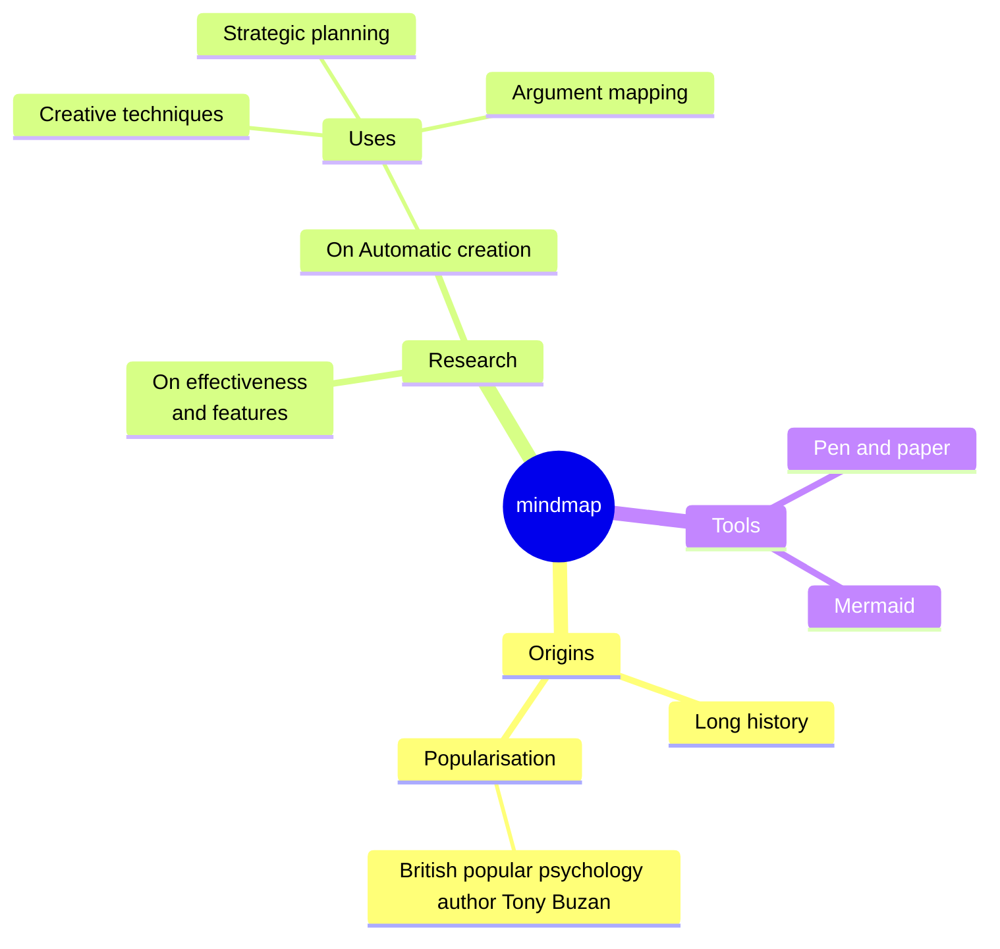

# Mindmap

Syntax authority: the official default example below (`@mermaid-js/examples` 1.4.0, MIT; keyword `mindmap`).

## Default example: Basic Mindmap

## Fit

Central topic expanding into concepts, options, notes, outlines — loose hierarchy.

## Rules

- Indentation encodes parent/child; one central topic only.
- Same level holds parallel concepts, not causality.
- Split oversized branches into separate maps.

## Avoid

Do not use a mindmap as a flowchart; hierarchy position must not imply undeclared causality, authority, or time.
