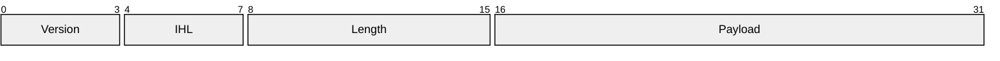

# Packet

## Purpose
Bit ranges of protocol packets and binary layouts: fields, widths, order, meaning.

## Minimal syntax

## Rules
- Bit ranges are contiguous and unambiguous; state whether numbering starts at 0 or 1.
- Field names, widths, endianness, reserved bits match the protocol spec.
- Line breaks for readability must not shift real offsets.

## Avoid
Do not draw field tables as flows; never adjust widths or drop reserved fields for cosmetics.
