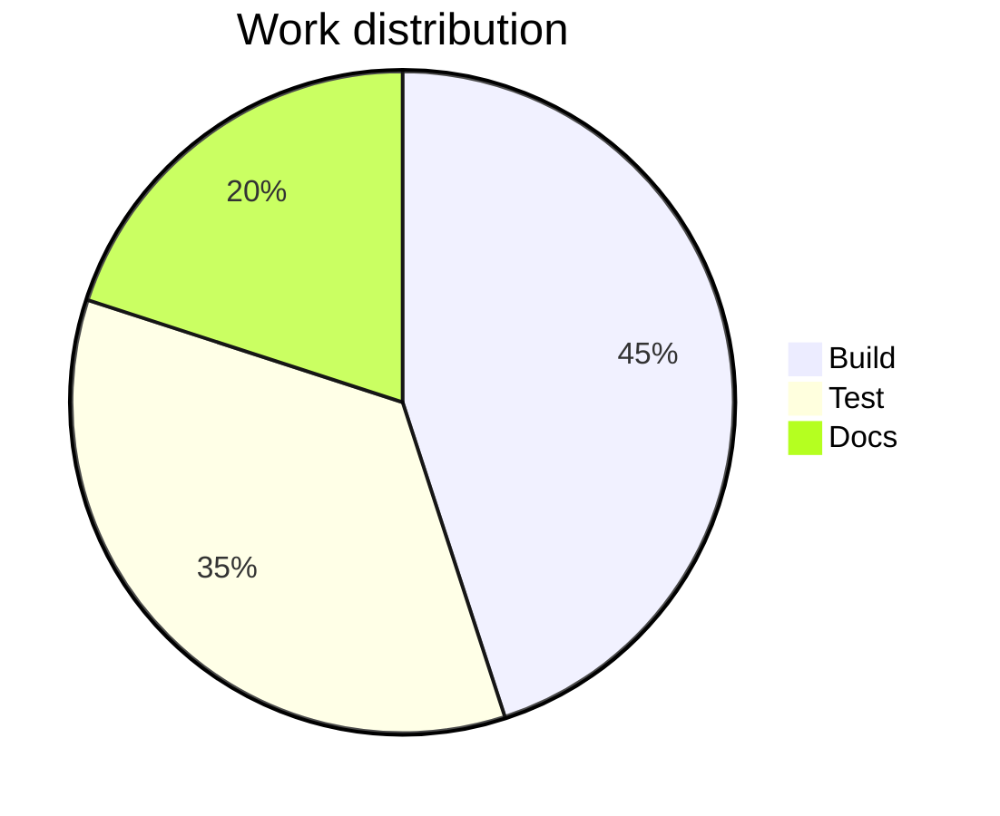

# Pie

## Purpose
Category shares of a single whole, few categories, meaningful sum.

## Minimal syntax

## Rules
- All values share one population, one measurement basis, one time window.
- Merge minor categories into "Other" when slices get many.
- The title names the whole and the basis.

## Avoid
Do not compare multiple time series or many near-equal slices; do not present unnormalized numbers as percentages.
