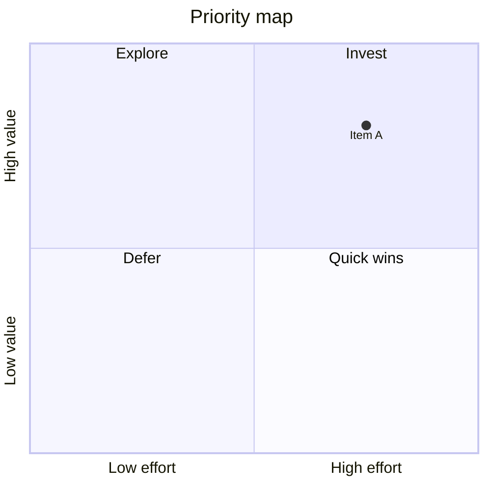

# Quadrant

## Purpose
Locate items on two well-defined continuous/ordinal axes with named zones.

## Minimal syntax

## Rules
- Define axis directions, units, and the dividing line first.
- Point coordinates come from data or stated judgement.
- Quadrant names carry decision meaning, not "quadrant 1".

## Avoid
Do not call any 2D scatter a priority map; point distance must not encode an undefined third dimension.
