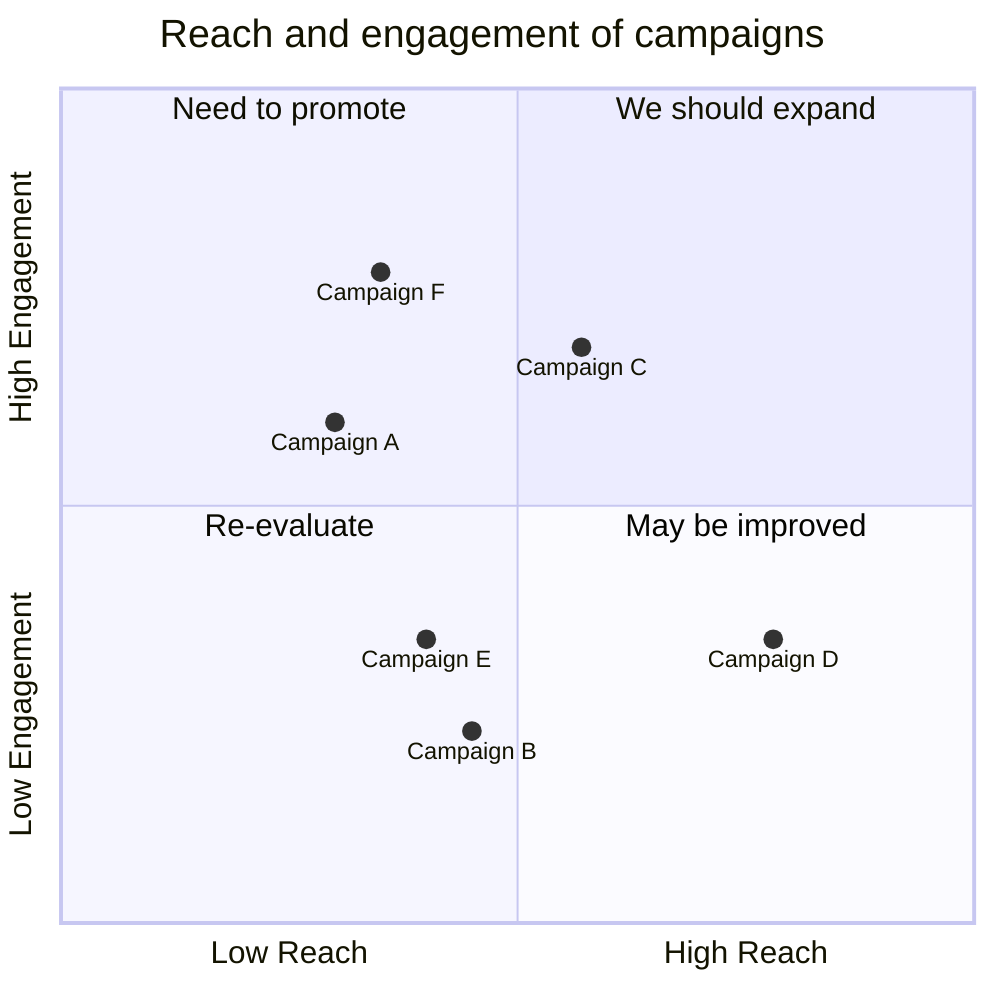

# Quadrant Chart

Syntax authority: the official default example below (`@mermaid-js/examples` 1.4.0, MIT; keyword `quadrantChart`).

## Default example: Product Positioning

## Fit

Locate items on two well-defined continuous/ordinal axes with named zones.

## Rules

- Define axis directions, units, and the dividing line first.
- Point coordinates come from data or stated judgement.
- Quadrant names carry decision meaning, not "quadrant 1".

## Avoid

Do not call any 2D scatter a priority map; point distance must not encode an undefined third dimension.
