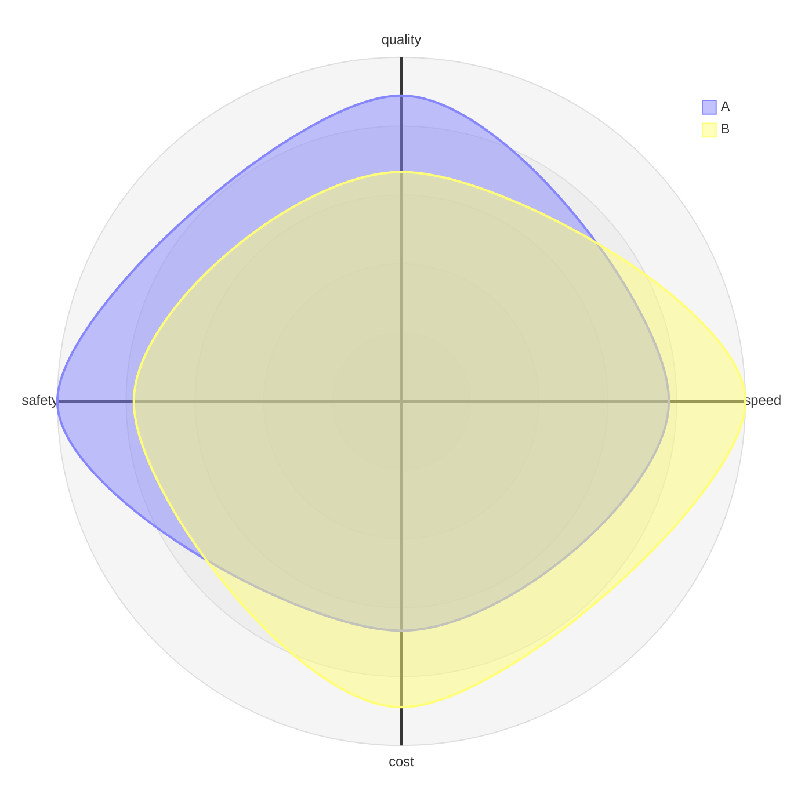

# Radar

## Purpose
Multi-metric profiles of several subjects on identical, normalized axes.

## Minimal syntax

## Rules
- All subjects share the same metric set, direction, and scale.
- Keep metrics few and meaningful; define what high/low means.
- Use only when the profile comparison itself is the point.

## Avoid
Do not mix scales; do not let enclosed area act as a hidden total score; confirm current syntax against the Live Editor example.
