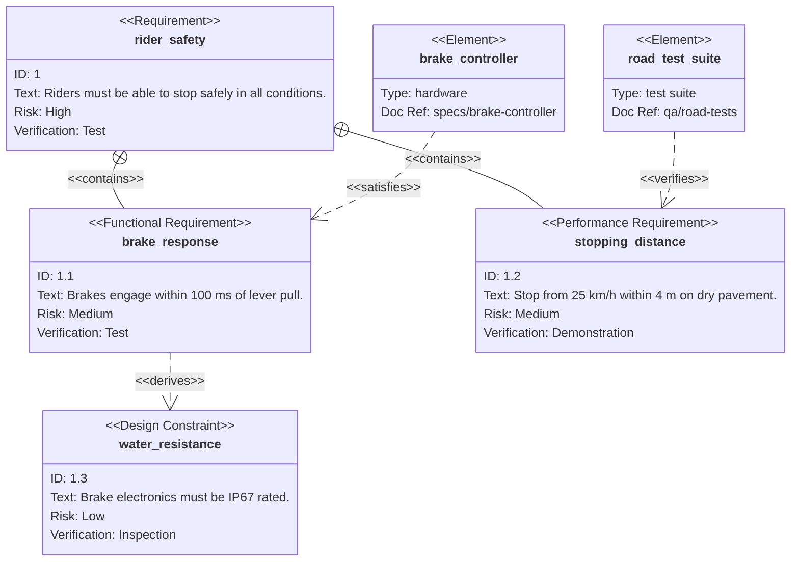

# Requirement Diagram

Syntax authority: the official default example below (`@mermaid-js/examples` 1.4.0, MIT; keyword `requirementDiagram`).

## Default example: E-Bike Braking System

## Fit

Requirements, elements, and tracing relations: contains, derives, satisfies, verifies, refines, traces, copies.

## Rules

- Each requirement has a stable ID, clear text, risk, and verification method.
- Relation direction answers "who satisfies/verifies/derives whom".
- The diagram carries tracing relations, not the requirement prose or acceptance criteria.

## Avoid

Do not pass off a task list as requirements; requirement IDs, verification methods, and tracing links must keep a single authoritative source.
