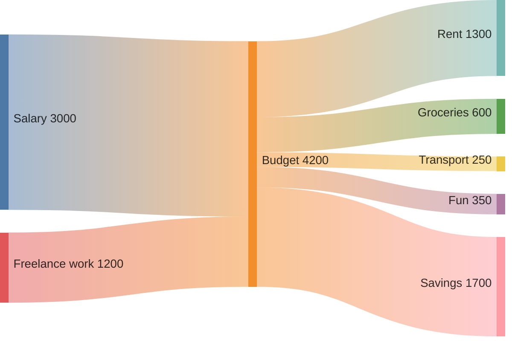

# Sankey Diagram

Syntax authority: the official default example below (`@mermaid-js/examples` 1.4.0, MIT; keyword `sankey-beta`).

## Default example: Monthly Budget Flow

## Fit

Flow of a quantity between stages or nodes: source, target, and an amount per edge.

## Rules

- Edge amounts are the data; node size is derived, never hand-set.
- All amounts share one unit; conservation per node is expected unless a loss is explicit.
- Node names are real stages, not abstractions.

## Avoid

A Sankey shows flow volume, not causation; do not draw feedback loops as a Sankey (use Flowchart); do not fake amounts to balance the diagram.
