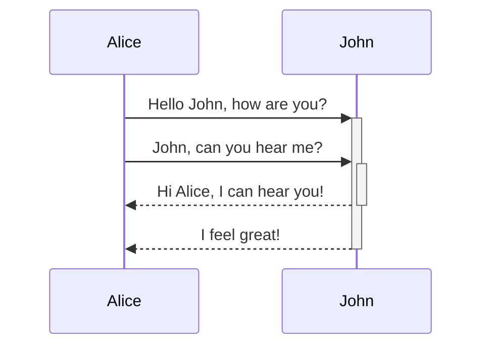

# Sequence Diagram

Syntax authority: the official default example below (`@mermaid-js/examples` 1.4.0, MIT; keyword `sequenceDiagram`).

## Default example: Basic Sequence

## Fit

Messages between participants over time: requests, replies, async sends, alternates, loops, parallelism.

## Rules

- Order participants by message traffic (busiest pairs adjacent); labels carry the action, protocol, or outcome.
- Use `alt`, `opt`, `loop`, `par` only for real control semantics.
- Distinguish sync calls, async sends, returns, and self-calls by arrow type.

## Avoid

Do not redraw "what state it becomes" as message spam; do not omit error replies and key returns.

## Verified layout pitfalls (measured on mermaid-cli 11.x)

- Long message labels spanning multiple lanes get centered over intermediate lifelines and visually collide with them. Two fixes, in order: (1) shorten the label to ~2-4 CJK chars; (2) order participants by message traffic so the busiest pair are adjacent — count potential lane crossings before authoring; minimum-crossing ordering is the best achievable, a thin lifeline crossing a short centered label is Mermaid's hard layout limit and is acceptable.
- Self-messages (`A->>A:`) with long labels extend past the left of enclosing `par`/`alt` frames and cross the actor's own lifeline; prefer `Note over A:` for phase annotations instead.
- Number badges (`autonumber`) can touch `par`/`alt` frame borders; unavoidable — only fix label text collisions.
