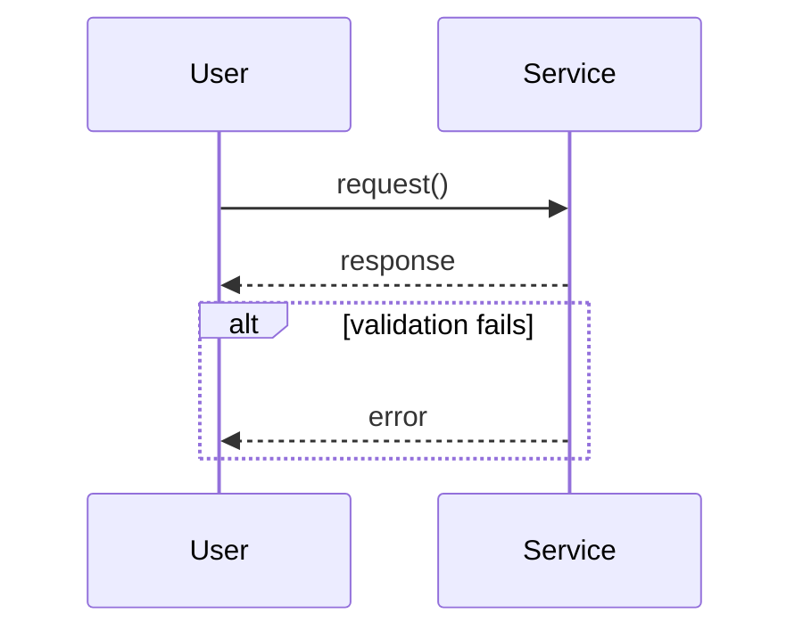

# Sequence

## Purpose
Messages between participants over time: requests, replies, async sends, alternates, loops, parallelism.

## Minimal syntax

## Rules
- Order participants by reading priority; labels carry the action, protocol, or outcome.
- Use `alt`, `opt`, `loop`, `par` only for real control semantics.
- Distinguish sync calls, async sends, returns, and self-calls by arrow type.

## Avoid
Do not redraw "what state it becomes" as message spam; do not omit error replies and key returns.
