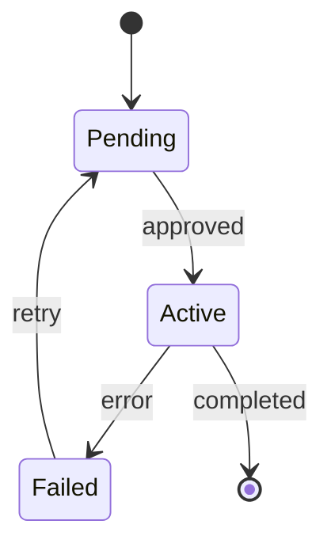

# State

## Purpose
Lifecycle of an object: states, events, guards, composite and parallel states, terminal states.

## Minimal syntax

## Rules
- A state is a stable condition; an event triggers the transition.
- Transition labels are events or guards, never vague "processing".
- Model retry, failure, recovery, and termination explicitly.

## Avoid
Do not treat every function call as a state; do not draw time-ordered messages that carry no state meaning.
