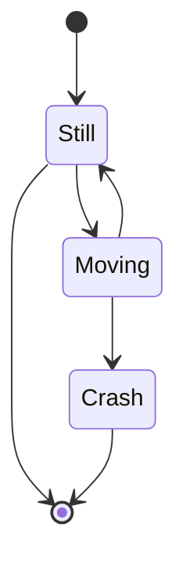

# State Diagram

Syntax authority: the official default example below (`@mermaid-js/examples` 1.4.0, MIT; keyword `stateDiagram-v2`).

## Default example: Basic State Diagram

## Fit

Lifecycle of an object: states, events, guards, composite and parallel states, terminal states.

## Rules

- A state is a stable condition; an event triggers the transition.
- Transition labels are events or guards, never vague "processing".
- Model retry, failure, recovery, and termination explicitly.

## Avoid

Do not treat every function call as a state; do not draw time-ordered messages that carry no state meaning.

## Verified syntax pitfalls (measured on mermaid-cli 11.x)

- Transition labels reject bare `::` (throws `got 'DESCR'`); rewrite with a dot or move the token into ` `-wrapped prose.
- State names are identifiers: a typo silently creates a second state — reuse declared IDs exactly.
- Bidirectional edge pairs (A→B and B→A) place both labels in one narrow band: long labels overlap there (measured in practice). Keep both under ~6 CJK chars, push detail into `%%` notes, and verify with a rendered visual pass.
