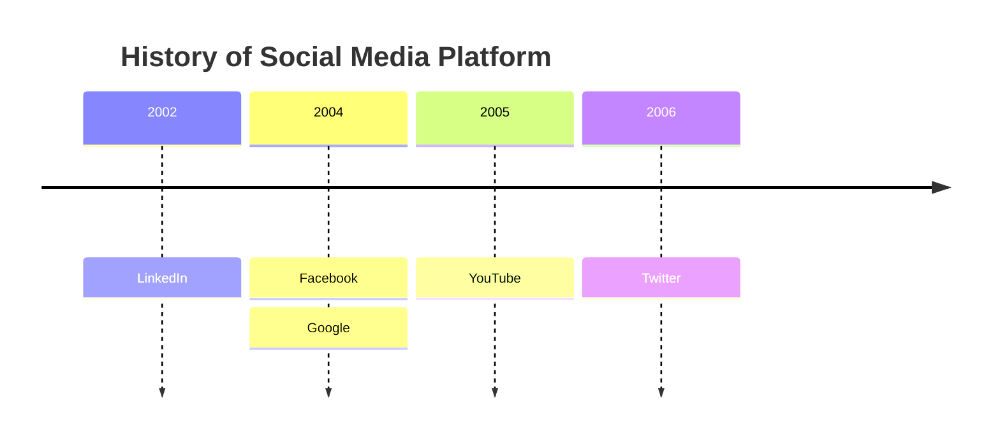

# Timeline Diagram

Syntax authority: the official default example below (`@mermaid-js/examples` 1.4.0, MIT; keyword `timeline`).

## Default example: Project Timeline

## Fit

Events in chronological order, optionally grouped into columns or periods.

## Rules

- Each entry is a dated event or period, not a task with duration and owner (that is Gantt).
- Order is real chronology; gaps between entries are allowed.

## Avoid

Do not use a timeline for task dependencies or work plans; do not compress unrelated eras to fit the view.
