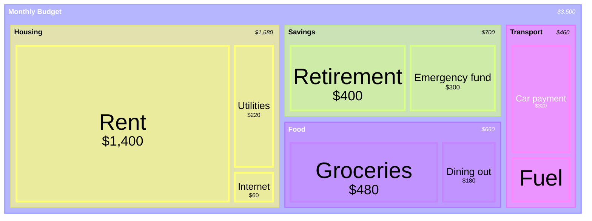

# Treemap

Syntax authority: the official default example below (`@mermaid-js/examples` 1.4.0, MIT; keyword `treemap-beta`).

## Default example: Monthly Household Budget

## Fit

Hierarchical quantity where area encodes size: top-down nesting down to leaf values.

## Rules

- Leaf values share one unit; the root is the whole.
- Keep nesting shallow (<=3 levels) for readability.

## Avoid

Do not use a treemap for flat lists or parts that do not sum to a whole; do not let area encode a second metric.
