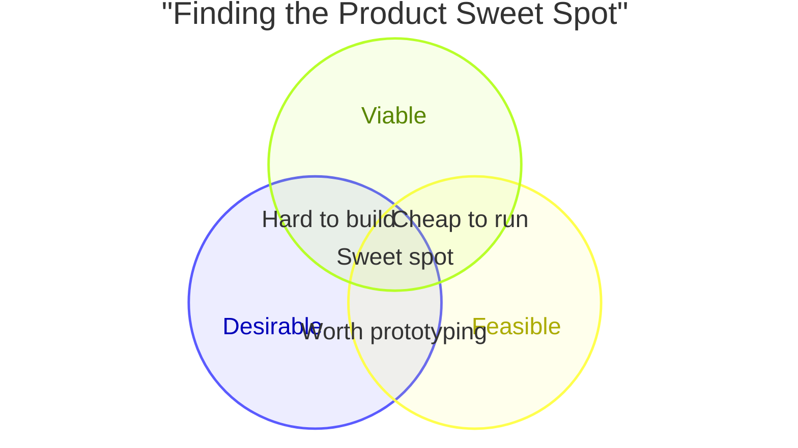

# Venn Diagram

Syntax authority: the official default example below (`@mermaid-js/examples` 1.4.0, MIT; keyword `venn-beta`).

## Default example: Product Sweet Spot

## Fit

Overlap of sets: membership, union, and intersection regions, each labelable.

## Rules

- Sets are crisp; every labeled region states what membership means.
- Keep to <=4 sets for readability; label only non-empty regions that carry meaning.

## Avoid

Do not use a Venn for hierarchy (use Mindmap) or fuzzy membership without a stated basis; do not place items in regions without evidence.
