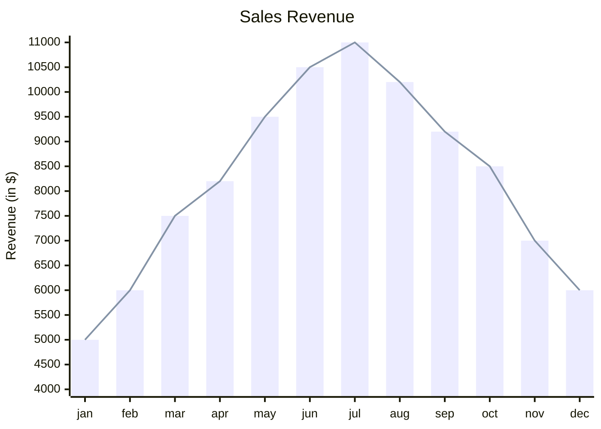

# XY Chart

Syntax authority: the official default example below (`@mermaid-js/examples` 1.4.0, MIT; keyword `xychart-beta`).

## Default example: Sales Revenue

## Fit

Quantitative series over categories or time: bar, line, point, plus optional range and error bands.

## Rules

- Axis labels and units are explicit; one scale per chart.
- Series must share the same unit and baseline.
- Keep the category axis ordered (time, sequence, or a stated sort).

## Avoid

Do not encode part-of-whole (use Pie/Treemap) or relations between items; do not mix incompatible units on one axis.
